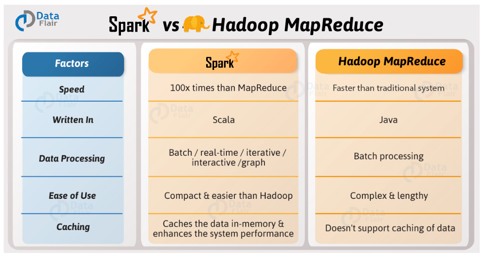
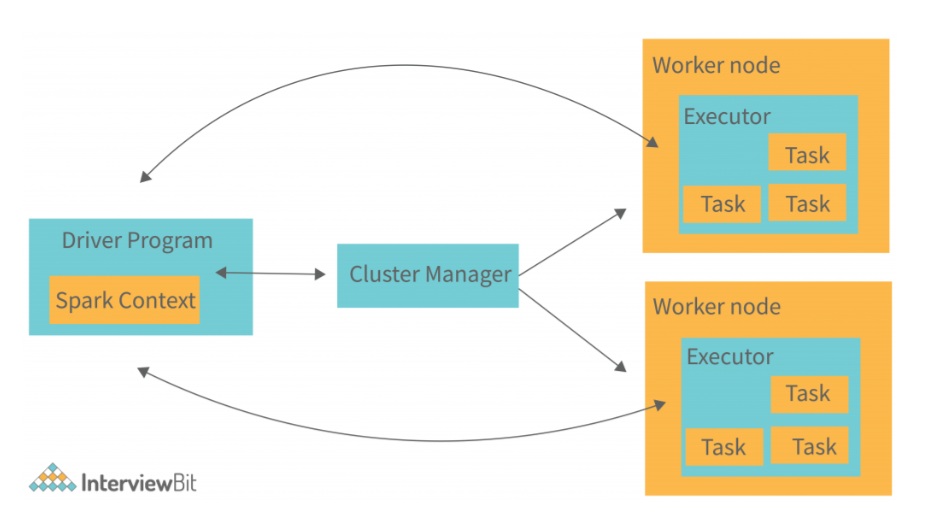

# Apache Spark Architecture

## Introduction

Today, organizations generate massive amounts of data from websites, mobile applications, sensors, transactions, social media platforms, and IoT devices.

Processing a few gigabytes of data on a single machine is relatively simple. However, when data grows into terabytes or petabytes, traditional data processing techniques become inefficient and often impossible.

Before Apache Spark existed, the industry primarily relied on **Apache Hadoop MapReduce** for large-scale distributed data processing.

To understand Spark Architecture properly, we first need to understand the limitations of Hadoop and why Spark was created.

---

# The Era Before Spark

## What is Hadoop?

Apache Hadoop is an open-source framework designed to store and process large datasets across multiple machines.

It introduced two major components:

### 1. HDFS (Hadoop Distributed File System)

HDFS is responsible for storing data across multiple machines.

Instead of storing a large file on a single server, Hadoop breaks it into smaller blocks and distributes them across multiple nodes.

#### Benefits of HDFS

- Fault Tolerance
- High Availability
- Scalability
- Distributed Storage

#### Example

A 1 TB file can be split into multiple blocks and stored across several machines in a cluster.

---

### 2. MapReduce

MapReduce is Hadoop's processing engine.

It processes data in two stages:

#### Map Phase

Input data is divided into smaller chunks.

Each machine processes its assigned chunk independently.

##### Example Input

```text
I love Spark
Spark is fast
I love Big Data
```

##### Mapper Output

```text
(I,1)
(love,1)
(Spark,1)
...
```

#### Reduce Phase

The framework groups similar keys together and performs aggregation.

##### Reducer Output

```text
I = 2
love = 2
Spark = 2
```

This approach enabled distributed processing for the first time and became the foundation of modern big data systems.

---

# Problems with Hadoop MapReduce

Although Hadoop was revolutionary, it had several limitations.

## 1. Excessive Disk I/O

After every Map phase and Reduce phase, data was written to disk.

```text
Map → Disk
Reduce → Disk
Map → Disk
Reduce → Disk
```

Disk operations are significantly slower than memory operations.

As datasets grew larger, performance suffered considerably.

---

## 2. Slow Iterative Processing

Machine Learning and Data Analytics workloads require repeated calculations on the same dataset.

MapReduce had to read data from disk repeatedly, making iterative processing very slow.

---

## 3. Complex Development

Even simple transformations required developers to write extensive Map and Reduce code.

This increased development effort and maintenance costs.

---

## 4. Poor Support for Real-Time Analytics

MapReduce was primarily designed for batch processing.

It was not suitable for:

- Streaming Applications
- Interactive Queries
- Real-Time Dashboards
- Machine Learning Workloads

Organizations needed a faster and more flexible processing engine.

---

# Birth of Apache Spark

Apache Spark was developed at the University of California, Berkeley's AMPLab.

The primary objective was simple:

> Process massive datasets much faster than Hadoop MapReduce.

Instead of repeatedly reading and writing intermediate data to disk, Spark introduced **In-Memory Processing**.

This innovation became the biggest reason behind Spark's popularity.

---

# Why Spark is Faster

Spark keeps intermediate data in memory whenever possible.

### Hadoop Approach

```text
Read Data
    ↓
Process
    ↓
Write to Disk
    ↓
Read Again
    ↓
Process
```

### Spark Approach

```text
Read Data
    ↓
Process in Memory
    ↓
Continue Processing
    ↓
Return Result
```

Because memory access is dramatically faster than disk access, Spark can process workloads significantly faster than Hadoop MapReduce.



---


# What is Apache Spark?

Apache Spark is an open-source distributed data processing engine designed for:

- Batch Processing
- Stream Processing
- Machine Learning
- Graph Processing
- Interactive Analytics

Spark does not replace storage systems such as HDFS, S3, or Azure Data Lake Storage.

Instead, Spark acts as a compute engine.

```text
HDFS / S3 / ADLS
        ↓
      Spark
        ↓
 Process Data
```

---

# High-Level Spark Architecture

```text
                User Application
                        |
                        v
                Spark Driver
                        |
      --------------------------------
      |              |              |
      v              v              v
   Executor 1     Executor 2     Executor 3
      |              |              |
      --------------------------------
                        |
                 Cluster Manager
```



---

# Components of Spark Architecture

Spark architecture mainly consists of:

1. Driver Program
2. Cluster Manager
3. Worker Nodes
4. Executors

Let's understand each component in detail.

---

# Driver Program

The Driver Program is the brain of a Spark application.

### Responsibilities

- Creates SparkSession
- Builds Execution Plans
- Creates DAGs
- Schedules Tasks
- Monitors Execution
- Collects Results

Example:

```python
spark.read.csv("data.csv")
```

The Driver interprets this command and creates an execution plan.

Without the Driver, no Spark application can run.

```text
Driver Node (VM)
    │
    └── Driver Process

Worker Node 1 (VM)
    │
    └── Executor

Worker Node 2 (VM)
    │
    └── Executor
```

---

# Cluster Manager

The Cluster Manager is responsible for resource allocation.

```text
Driver
    │
    └── Requests Resources
             │
             ▼
      Cluster Manager
             │
             ▼
         Executors
```

### Responsibilities

- Allocate CPU Resources
- Allocate Memory Resources
- Launch Executors
- Manage Cluster Resources

### Supported Cluster Managers

#### Standalone

Spark's built-in cluster manager.

#### YARN

Commonly used with Hadoop ecosystems.

#### Kubernetes

Widely used in modern cloud-native deployments.

#### Apache Mesos

Less common today but still supported.

---

# Worker Nodes

Worker Nodes are machines that perform the actual computation.

Each worker node contributes:

- CPU
- Memory
- Storage

A Spark cluster may consist of dozens or even hundreds of worker nodes.

---

# Executors

Executors are long-running **JVM (Java Virtual Machine) processes** launched by the Cluster Manager on Worker Nodes for a specific Spark application.

They are responsible for executing tasks assigned by the Driver and storing intermediate computation results in memory or disk.

Unlike Hadoop MapReduce, where resources are allocated for each individual job phase, Spark Executors typically remain alive for the entire lifetime of the Spark application.

---

## Responsibilities of Executors

### 1. Execute Tasks

The Driver breaks a Spark Job into Stages and Tasks.

These tasks are distributed across multiple Executors for parallel execution.

```text
Driver
   │
   ├── Task 1 ──► Executor 1
   ├── Task 2 ──► Executor 2
   ├── Task 3 ──► Executor 3
   └── Task 4 ──► Executor 1
```

---

### 2. Cache and Persist Data

Executors can store intermediate datasets in memory.

This is one of the primary reasons Spark is significantly faster than Hadoop MapReduce.

Example:

```python
df.cache()
```

The cached partitions are stored inside Executor memory, reducing expensive disk reads during subsequent operations.

---

### 3. Shuffle Data

Executors participate in shuffle operations such as:

- groupBy()
- join()
- distinct()
- repartition()

During a shuffle, Executors exchange data partitions across the cluster.

---

### 4. Return Results to Driver

After task execution completes, Executors send results, metrics, and execution status information back to the Driver.

```text
Executor
    │
    └── Task Result
             │
             ▼
          Driver
```

---

## Executor Internals

Each Executor process contains:

```text
Executor JVM Process
│
├── Task Threads
├── Block Manager
├── Cache Storage
├── Shuffle Manager
└── Executor Memory
```

### Task Threads

Responsible for executing tasks in parallel.

The number of concurrent tasks depends on the number of cores allocated to the Executor.

Example:

```text
Executor
4 Cores
    │
    ├── Task Thread 1
    ├── Task Thread 2
    ├── Task Thread 3
    └── Task Thread 4
```

---

### Block Manager

Responsible for managing:

- Cached Data
- Broadcast Variables
- Shuffle Data

The Block Manager is one of the core components inside every Executor.

---

### Executor Memory

Executor memory is divided into multiple regions.

```text
Executor Memory
│
├── Execution Memory
│    ├── Joins
│    ├── Sorts
│    └── Aggregations
│
└── Storage Memory
     ├── Cached Data
     └── Persisted RDDs
```

---

## Executor Lifecycle

```text
Spark Application Starts
           │
           ▼
Driver Requests Resources
           │
           ▼
Cluster Manager Launches Executors
           │
           ▼
Executors Execute Tasks
           │
           ▼
Application Completes
           │
           ▼
Executors Terminated
```

Executors are application-scoped, meaning Executors created for one Spark application cannot be shared with another Spark application.

---

## Key Point

In Spark, for a given stage, each partition is processed by exactly one task. Therefore, the number of tasks in a stage equals the number of partitions in the input data for that stage. Executors are responsible for executing those tasks, and a single executor can execute many tasks over its lifetime depending on the available cores and scheduling.

An Executor is a dedicated JVM process running on a Worker Node that executes tasks, manages memory and storage, performs shuffle operations, and communicates execution results back to the Driver throughout the lifetime of a Spark application.