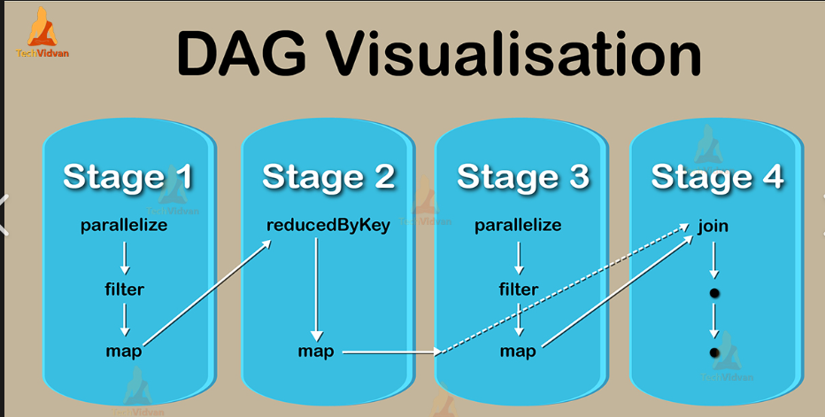
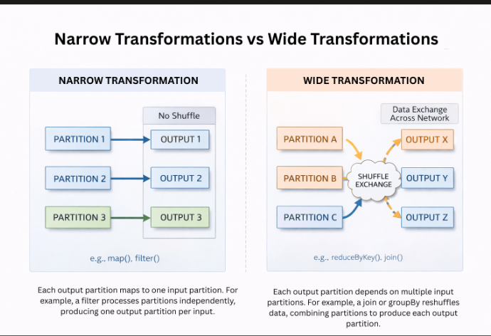
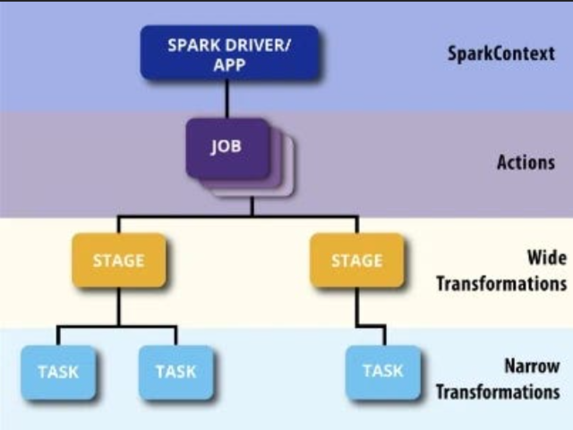

# DAG & Execution Flow in Apache Spark

## Introduction

One of the biggest reasons behind Spark's performance is that it does **not execute transformations immediately**.

Instead of running every operation as soon as it is written, Spark first analyzes the entire computation, creates an execution plan, optimizes it, and then executes it efficiently across the cluster.

This behavior is fundamentally different from traditional programming languages where statements execute one after another.

Consider the following PySpark code:

```python
df = spark.read.parquet("sales")

result = (
    df.filter(col("amount") > 1000)
      .groupBy("city")
      .sum("amount")
)

result.show()
```

At first glance, it might look like Spark executes:

1. Read data
2. Filter data
3. Group data
4. Aggregate data

immediately.

But that's not what happens.

Spark first builds a logical representation of the work that needs to be done.

This representation is called a **DAG (Directed Acyclic Graph)**.

---

# Why Does Spark Use a DAG?

Before understanding the DAG itself, let's understand the problem Spark is trying to solve.

Imagine Spark executed every line immediately:

```python
df = spark.read.parquet("sales")

filtered = df.filter(col("amount") > 1000)

grouped = filtered.groupBy("city")
```

Spark would have to:

- Read data
- Execute filter
- Store result
- Execute groupBy
- Store result

This approach would create unnecessary work and prevent Spark from optimizing the overall query.

Instead, Spark postpones execution and first understands the complete workflow.

This allows Spark to:

- Combine operations
- Remove unnecessary computations
- Push filters closer to data sources
- Optimize resource utilization

---

# What is a DAG?

DAG stands for:

**Directed Acyclic Graph**

Let's break it down:

### Directed

Operations have a specific execution direction.

```text
Read
  ↓
Filter
  ↓
GroupBy
  ↓
Aggregation
```

---

### Acyclic

The graph cannot loop back to itself.

Valid:

```text
A → B → C
```

Invalid:

```text
A → B → C
↑       │
└───────┘
```

Spark execution plans never contain cycles.

---

### Graph

Each operation becomes a node.

```text
Read
  ↓
Filter
  ↓
GroupBy
  ↓
Sum
```

This graph represents the workflow Spark intends to execute.


---

# Lazy Evaluation

A DAG exists because Spark uses **Lazy Evaluation**.

Transformations do not execute immediately.

Example:

```python
df = spark.read.parquet("sales")

filtered = df.filter(col("amount") > 1000)

grouped = filtered.groupBy("city")
```

At this point:

```text
No Job Created
No Task Executed
No Executor Activity
```

Spark only records the transformations.

Execution begins only when an Action is called.

Example:

```python
grouped.count()
```

Now Spark starts building an execution plan.

---

# Transformations vs Actions

Understanding this distinction is critical.

## Transformations

Transformations create a new DataFrame, Dataset, or RDD.

Examples:

```python
filter()
select()
groupBy()
join()
withColumn()
drop()
repartition()
```

Characteristics:

- Lazy
- Build DAG
- No execution

---

## Actions

Actions trigger execution.

Examples:

```python
show()
count()
collect()
take()
first()
write()
save()
```

Characteristics:

- Trigger Job Creation
- Execute DAG
- Return Results

---

# Spark Execution Flow

When an Action is triggered, Spark follows a series of steps.

```text
User Code
    ↓
Logical Plan
    ↓
Catalyst Optimizer
    ↓
Physical Plan
    ↓
DAG Scheduler
    ↓
Stages
    ↓
Tasks
    ↓
Executors
```

Let's understand each step.

---

# Step 1: User Writes Code

Example:

```python
sales_df = spark.read.parquet("sales")

result = (
    sales_df
        .filter(col("amount") > 1000)
        .groupBy("city")
        .sum("amount")
)

result.show()
```

---

# Step 2: Logical Plan Creation

The Driver converts code into a Logical Plan.

Example:

```text
Read sales
    ↓
Filter amount > 1000
    ↓
Group By city
    ↓
Sum amount
```

The Logical Plan describes **what needs to be done**, not **how it will be executed**.

---

# Step 3: Catalyst Optimizer

Spark's Catalyst Optimizer analyzes the Logical Plan.

Catalyst performs:

- Predicate Pushdown
- Constant Folding
- Projection Pruning
- Join Reordering
- Expression Simplification

Example:

Suppose a table contains 50 columns.

Query:

```python
df.select("city")
```

Catalyst reads only the required column instead of all 50 columns.

This reduces:

- Disk I/O
- Network Transfer
- Memory Usage

---

# Step 4: Physical Plan Generation

After optimization, Spark generates a Physical Plan.

The Physical Plan specifies:

- How data will be read
- Which operators will execute
- Which algorithms will be used

Example:

```text
Hash Aggregate
    ↓
Exchange
    ↓
Filter
    ↓
File Scan
```

---

# Step 5: DAG Scheduler

The DAG Scheduler converts the Physical Plan into stages.

This is where Spark begins preparing actual execution.

---

# Narrow vs Wide Transformations

The DAG Scheduler uses dependencies to create stages.

## Narrow Transformation

A child partition depends on only one parent partition.

Examples:

```python
filter()
select()
map()
flatMap()
```

```text
Partition 1 → Partition 1
Partition 2 → Partition 2
Partition 3 → Partition 3
```

No data movement occurs.

Fast.

---

## Wide Transformation

A child partition depends on multiple parent partitions.

Examples:

```python
groupBy()
join()
distinct()
repartition()
```

```text
Partition 1 ─┐
Partition 2 ─┼──► New Partition
Partition 3 ─┘
```

Requires data movement across executors.

This process is called:

## Shuffle



---

# Stage Creation

Stages are separated by shuffle boundaries.

Example:

```python
df.filter(...)
  .groupBy(...)
  .sum(...)
```

Execution:

```text
Stage 1
Read
Filter

----- Shuffle -----

Stage 2
GroupBy
Aggregation
```

Every shuffle creates a stage boundary.

---

# Jobs, Stages, and Tasks

This is one of the most important Spark concepts.

---

## Job

Created when an Action is triggered.

Example:

```python
df.count()
```

Produces:

```text
1 Job
```

---

## Stage

A Job is divided into Stages.

Stages are separated by shuffles.

Example:

```text
Job
├── Stage 1
└── Stage 2
```

---

## Task

A Stage is divided into Tasks.

Each partition corresponds to one task.

Example:

```text
100 Partitions
=
100 Tasks
```

---

## Relationship

```text
Job
│
├── Stage 1
│     ├── Task 1
│     ├── Task 2
│     └── Task 3
│
└── Stage 2
      ├── Task 4
      ├── Task 5
      └── Task 6
```


---

# Task Scheduling

The Driver sends tasks to Executors.

Example:

```text
Driver
│
├── Task 1 ──► Executor 1
├── Task 2 ──► Executor 2
├── Task 3 ──► Executor 3
└── Task 4 ──► Executor 1
```

Remember:

```text
1 Partition = 1 Task
```

Executors execute tasks in parallel based on available cores.

---

# End-to-End Example

Suppose we have:

```python
sales_df = spark.read.parquet("sales")

result = (
    sales_df
        .filter(col("amount") > 1000)
        .groupBy("city")
        .sum("amount")
)

result.show()
```

Execution:

```text
Action (show)
      ↓
Create Job
      ↓
Build Logical Plan
      ↓
Catalyst Optimization
      ↓
Create Physical Plan
      ↓
Generate DAG
      ↓
Split into Stages
      ↓
Create Tasks
      ↓
Assign Tasks to Executors
      ↓
Execute
      ↓
Return Results
```
---
# DAGs Are Not Always Linear

When people first learn Spark DAGs, they often imagine a simple execution flow:

```text
Read
 ↓
Filter
 ↓
GroupBy
 ↓
Aggregate
```

While this is a valid DAG, real-world Spark applications rarely follow a perfectly linear path.

A DAG is a **graph**, not a straight line.

This means multiple independent branches can exist within the same execution plan and later converge into a single operation.

---

## Multiple Parent Nodes Can Feed a Single Child Node

Consider the following Spark operation:

```python
customers_df.join(orders_df, "customer_id")
```

Spark needs data from both DataFrames before performing the join.

Conceptually, the DAG looks like:

```text
Customers Data
      │
      ▼
   Stage 1
      │
      └────────┐

               ▼
           Join Stage
               ▲

      ┌────────┘
      │

   Stage 2
      │
      ▼
 Orders Data
```

In this example:

- Stage 1 processes the Customers dataset.
- Stage 2 processes the Orders dataset.
- The Join Stage depends on the output of both stages.

The downstream stage cannot start until all required upstream stages have completed.

---

## DAG Representation

The same concept can be represented more abstractly:

```text
Node A ───┐
          │
          ▼
        Node C
          ▲
          │
Node B ───┘
```

Here:

- Node C depends on both Node A and Node B.
- Spark waits for both branches to complete before continuing execution.

This pattern is extremely common in Spark workloads.

---

## Real-World Example: Join Operations

Suppose we have three datasets:

```python
sales_df
customers_df
products_df
```

And the following query:

```python
result = (
    sales_df
        .join(customers_df, "customer_id")
        .join(products_df, "product_id")
)
```

The execution graph may resemble:

```text
Sales Data ───────┐
                  │
                  ▼
              Join Stage 1
                  │
                  ▼
        Intermediate Result
                  │
                  ▼
Products Data ───► Join Stage 2
```

Multiple branches contribute data before Spark can produce the final result.

---

## Why This Is Allowed

A DAG stands for:

**Directed Acyclic Graph**

Let's focus on the word **Graph**.

A graph allows:

- Multiple parent nodes
- Multiple child nodes
- Branching paths
- Converging paths

Therefore, this is completely valid:

```text
A ───┐
     │
     ▼
     C
     ▲
     │
B ───┘
```

---

## What Is Not Allowed?

Spark DAGs cannot contain cycles.

The following is invalid:

```text
A
│
▼
B
│
▼
C
│
▼
A
```

Because execution would loop forever.

This violates the **Acyclic** property of a DAG.

---

## Key Takeaway

A Spark DAG is not restricted to a straight-line execution flow.

Multiple independent branches can process data in parallel and later converge into a single stage. This commonly occurs during:

- Joins
- Union Operations
- Multi-source ETL Pipelines
- Complex Analytical Queries

- Spark uses Lazy Evaluation.
- Transformations build a DAG but do not execute.
- Actions trigger execution.
- Catalyst Optimizer improves query performance.
- Wide transformations create shuffles.
- Shuffles create stage boundaries.
- One partition corresponds to one task.
- Executors execute tasks, while the Driver manages Jobs and Stages.
- DAG-based execution enables Spark to optimize workloads before execution.


Understanding this concept is important because real-world Spark DAGs often resemble interconnected graphs rather than simple linear workflows.

Note: Spark builds up a lineage of transformations as you write them, and the actual DAG for execution is finalized when an Action is triggered.
